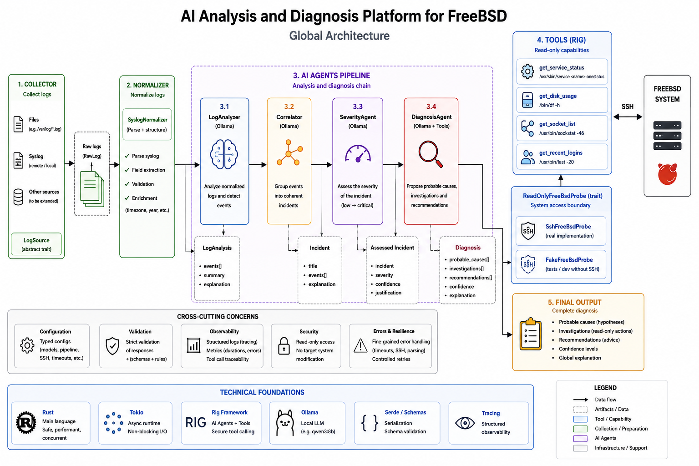

#+title: Syslog AI on FreeBSD
* Introduction
Just to brainstorm about a multi-agent system conception thank to AI. The idea is to analyze different logs from a /FreeBSD/ server using /jails/ as architecture.
* Architecture

* Organization
** Global
#+begin_src emacs-lisp
otoko/
│
├── Cargo.toml
├── Cargo.lock
│
├── src/
│   ├── main.rs
│   ├── lib.rs
│   │
│   ├── agents/
│   │   ├── mod.rs
│   │   ├── prompt.rs
│   │   │
│   │   ├── correlator.rs
│   │   ├── mock_correlator.rs
│   │   ├── ollama_correlator.rs
│   │   │
│   │   ├── severity.rs
│   │   ├── severity_validator.rs
│   │   ├── mock_severity.rs
│   │   ├── ollama_severity.rs
│   │   │
│   │   ├── diagnosis.rs
│   │   ├── diagnosis_validator.rs
│   │   ├── mock_diagnosis.rs
│   │   ├── ollama_diagnosis.rs
│   │   │
│   │   ├── mock_analyzer.rs
│   │   ├── ollama_analyzer.rs
│   │   └── validator.rs
│   │
│   ├── collector/
│   │   ├── mod.rs
│   │   ├── fake.rs
│   │   └── ssh.rs
│   │
│   ├── config/
│   │   ├── mod.rs
│   │   ├── analyzer.rs
│   │   ├── correlator.rs
│   │   ├── severity.rs
│   │   ├── diagnosis.rs
│   │   ├── pipeline.rs
│   │   └── ssh.rs
│   │
│   ├── domain/
│   │   ├── mod.rs
│   │   ├── log.rs
│   │   ├── event.rs
│   │   ├── incident.rs
│   │   ├── severity.rs
│   │   ├── diagnosis.rs
│   │   ├── analysis.rs
│   │   └── report.rs
│   │
│   ├── normalizer/
│   │   ├── mod.rs
│   │   └── syslog.rs
│   │
│   ├── orchestration/
│   │   ├── mod.rs
│   │   └── pipeline.rs
│   │
│   ├── probes/
│   │   ├── mod.rs
│   │   ├── fake.rs
│   │   └── ssh.rs
│   │
│   └── tools/
│       ├── mod.rs
│       ├── service_status.rs
│       ├── disk_usage.rs
│       ├── socket_list.rs
│       └── recent_logins.rs
│
└── tests/
    ├── diagnosis.rs
    ├── ollama_diagnosis.rs
    ├── ollama_diagnosis_tools.rs
    ├── pipeline.rs
    ├── ssh_probe.rs
    └── tools.rs
#+end_src
** Logical Organisation
#+begin_src emacs-lisp
collector/
    │
    │ récupération des logs
    ▼
normalizer/
    │
    │ RawLog → LogBatch
    ▼
agents/
    │
    │ Analyzer
    │ Correlator
    │ Severity
    │ Diagnosis
    ▼
orchestration/
    │
    │ coordination du pipeline
    ▼
domain/
    │
    │ structures métier
    ▼
résultat
#+end_src
** Extension branch
#+begin_src emacs-lisp
DiagnosisAgent
      │
      │ tool calling Rig
      ▼
    tools/
      │
      │ API autorisée
      ▼
    probes/
      │
      ├──────────────┐
      ▼              ▼
 FakeFreeBsdProbe   SshFreeBsdProbe
                         │
                         │ SSH
                         ▼
                      FreeBSD
#+end_src
* Functions
** Summary
Just to break down the platform into six main areas of responsibility, 4 of which actually use an /LLM/.

#+begin_src emacs-lisp
Component           AI              Responsibility
Collector           ❌              Collect FreeBSD logs
Normalizer          ❌              Convert logs into Rust structures
Log Analyzer Agent  ✅              Analyze each group of logs
Correlator Agent    ✅              Detect related events
Severity Agent      ✅/optional     Assess severity
Diagnosis Agent     ✅              Suggest causes and investigations
Reporter Agent      ✅              Generate a clear report
Orchestrator        ❌ initially    Coordinate the workflow
#+end_src

** Log Analyzer Agent
His role:
+ Analyze a set of logs and identify significant events.
** Correlator Agent
He asks the question:
+ Are these events related?
#+begin_src emacs-lisp
LogAnalyzer
     │
     │ Vec<DetectedEvent>
     ▼
Correlator
     │
     │ Incident
     ▼
...
#+end_src
** Severity Agent
He responds only to:
+ How serious is this incident?
** Diagnosis Agent
He receives:
+ Incident
+ Severity Assessment
and looking for
#+begin_src emacs-lisp
POSSIBLE CAUSES
       │
       ├── SSH brute force attack
       ├── compromised password
       └── possible false positive

INVESTIGATIONS
       │
       ├── check /var/log/auth.log
       ├── check “last”
       ├── look up source IP
       └── check sudo commands

RECOMMENDATIONS
       │
       ├── check the SSH key
       ├── disable password authentication
       └── temporarily block the IP
#+end_src
** Reporter Agent
Input
+ Incident
+ Severity Assessment
+ Diagnosis
and the result (for example)
#+begin_src emacs-lisp
====================================================
INCIDENT REPORT
====================================================

Severity: HIGH

Incident:
Suspicious SSH authentication activity

Summary:
Multiple failed login attempts originating from
192.168.1.52 were followed by a successful login.

Evidence:

  13:41 failed root login
  13:42 failed root login
  13:42 failed admin login
  13:44 successful spike login

Possible cause:

  SSH brute force followed by successful compromise.

Recommended investigations:

  - inspect last
  - inspect sudo logs
  - inspect running processes
  - verify the source IP
#+end_src
